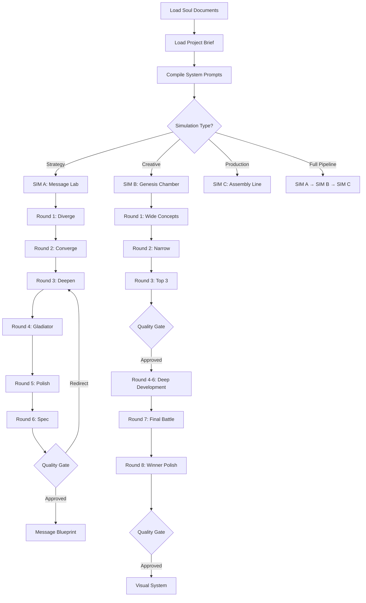
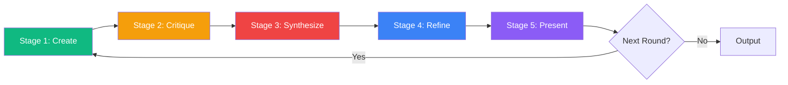
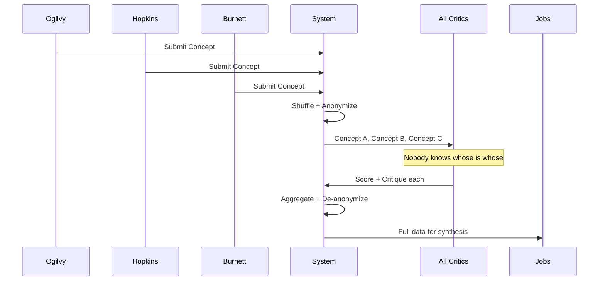
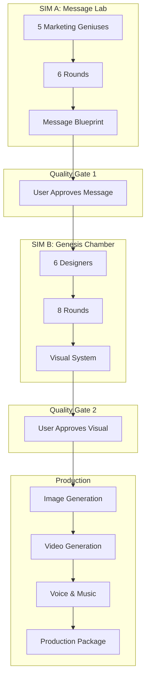
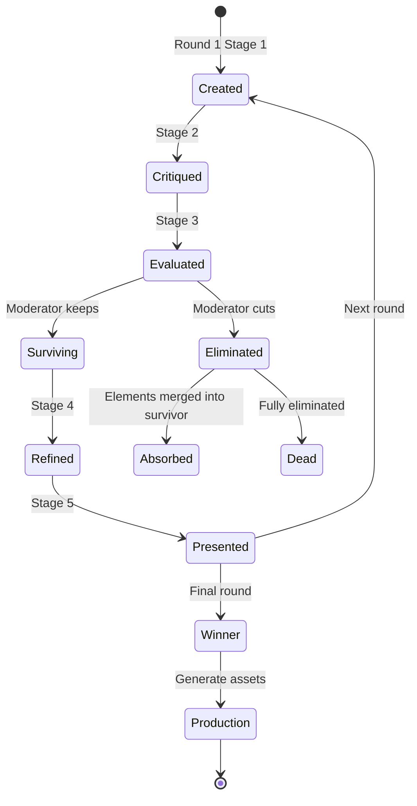

# Genesis Chamber — Flow Diagrams

## Full Simulation Flow (Mermaid)

```mermaid
graph TD
    A[Load Soul Documents] --> B[Load Project Brief]
    B --> C[Compile System Prompts]
    C --> D{Simulation Type?}
    D -->|Strategy| E[SIM A: Message Lab]
    D -->|Creative| F[SIM B: Genesis Chamber]
    D -->|Production| G[SIM C: Assembly Line]
    D -->|Full Pipeline| H[SIM A → SIM B → SIM C]

    E --> E1[Round 1: Diverge]
    E1 --> E2[Round 2: Converge]
    E2 --> E3[Round 3: Deepen]
    E3 --> E4[Round 4: Gladiator]
    E4 --> E5[Round 5: Polish]
    E5 --> E6[Round 6: Spec]
    E6 --> QG1{Quality Gate}
    QG1 -->|Approved| OUT1[Message Blueprint]
    QG1 -->|Redirect| E3

    F --> F1[Round 1: Wide Concepts]
    F1 --> F2[Round 2: Narrow]
    F2 --> F3[Round 3: Top 3]
    F3 --> QG2{Quality Gate}
    QG2 -->|Approved| F4[Round 4-6: Deep Development]
    F4 --> F5[Round 7: Final Battle]
    F5 --> F6[Round 8: Winner Polish]
    F6 --> QG3{Quality Gate}
    QG3 -->|Approved| OUT2[Visual System]
```

## Single Round Flow

```mermaid
graph LR
    S1[Stage 1: Create] --> S2[Stage 2: Critique]
    S2 --> S3[Stage 3: Synthesize]
    S3 --> S4[Stage 4: Refine]
    S4 --> S5[Stage 5: Present]
    S5 --> NR{Next Round?}
    NR -->|Yes| S1
    NR -->|No| OUT[Output]

    style S1 fill:#10B981,color:#fff
    style S2 fill:#F59E0B,color:#fff
    style S3 fill:#EF4444,color:#fff
    style S4 fill:#3B82F6,color:#fff
    style S5 fill:#8B5CF6,color:#fff
```

## Stage Detail: Critique Anonymization

```mermaid
sequenceDiagram
    participant O as Ogilvy
    participant H as Hopkins
    participant B as Burnett
    participant SYS as System
    participant ALL as All Critics

    O->>SYS: Submit Concept
    H->>SYS: Submit Concept
    B->>SYS: Submit Concept
    SYS->>SYS: Shuffle + Anonymize
    SYS->>ALL: Concept A, Concept B, Concept C
    Note over ALL: Nobody knows whose is whose
    ALL->>SYS: Score + Critique each
    SYS->>SYS: Aggregate + De-anonymize
    SYS->>Jobs: Full data for synthesis
```

## Chained Simulation Pipeline

```mermaid
graph TB
    subgraph "SIM A: Message Lab"
        A1[5 Marketing Geniuses] --> A2[6 Rounds]
        A2 --> A3[Message Blueprint]
    end

    subgraph "Quality Gate 1"
        QG1[User Approves Message]
    end

    subgraph "SIM B: Genesis Chamber"
        B1[6 Designers] --> B2[8 Rounds]
        B2 --> B3[Visual System]
    end

    subgraph "Quality Gate 2"
        QG2[User Approves Visual]
    end

    subgraph "Production"
        P1[Image Generation] --> P2[Video Generation]
        P2 --> P3[Voice & Music]
        P3 --> P4[Production Package]
    end

    A3 --> QG1
    QG1 --> B1
    B3 --> QG2
    QG2 --> P1
```

## Concept Lifecycle

```mermaid
stateDiagram-v2
    [*] --> Created: Round 1 Stage 1
    Created --> Critiqued: Stage 2
    Critiqued --> Evaluated: Stage 3
    Evaluated --> Surviving: Moderator keeps
    Evaluated --> Eliminated: Moderator cuts
    Surviving --> Refined: Stage 4
    Refined --> Presented: Stage 5
    Presented --> Created: Next round
    Presented --> Winner: Final round
    Eliminated --> Absorbed: Elements merged into survivor
    Eliminated --> Dead: Fully eliminated

    Winner --> Production: Generate assets
    Production --> [*]
```
